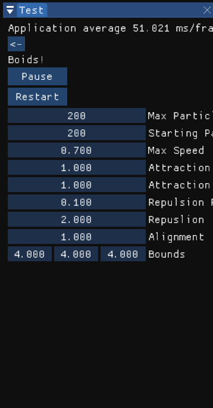

# Glados
This is me learning graphics programming by building my own renderer using OpenGL and ImGui. Most of this code can be found at: https://github.com/TheCherno/Hazel

# Build Instructions

- Start by cloning the repository with git clone `git clone --branch FinalProject --recursive https://github.com/msunde137/Glados`
- Run GenerateGlados.bat to make the project files

# CS312 Final Project

.gif)

## Project Description

For this project I added support for particle systems into the preexisting Glados library, and experimented with boids! I started by updating the existing renderer with the batch renderer from Hazel to make passing lots of quads to the GPU faster. Unfortunately this involved a lot of debugging of both my and TheCherno's code, but I'm glad I have it now that everything works. Next, I used a lot of code from our previous lab to make a more abstract particle class that is easier to subclass. I added test to my prexisting test framework, and got everything working with the confetti particle system from the previous lab. Now I was able to research and implement a boid particle system. The final piece of this project was optimization. Storing and updating particles in a stack was inefficiet for large numbers of particles, so Aline suggested I implement a kd-tree handle searching for the each particle's neighbors. I ended up using the kd-tree in https://github.com/snape/RVO2-3D, and modified it to be able to subclass my Particle class. This allows for me to use the kd tree in other simulations/features that I might add in the future, such as collision detection.

## Implemented Features

### Particle class with ImGui wiggets

I have implemented an abstract particle class with Update, Render, and ImGuiRender methods that will be partially overwritten by subclasses. When using the boid demos, the ImGui controlls will look like this:

Implemented in the base class:

- Max Particles: How many particles the system can handle. Changing this value won't remove particles from the system.
- Starting Particles: How many particles to initiallize the system with.

Implemented in the boid subclasses:

- Max Speed: How fast the particles can travel.
- Attraction Range: Max distance for neighbor search.
- Attraction: Strength of attraction.
- Repulsion Range: Max distance of repulsion.
- Repulsion: Strength of the repulsion.
- Alignment: How heavily to weight the alignemnt of partiles.
- Bounds: The bounding box of the particle system.

### Batch renderer

### KdTree

## Results

The boids that I experimented with as a part of the project worked out well. The ammount of time I spent setting everything up, limmited how creative I was able to be with the particle systems themselves, but what I have now behaves exactly as exptected. With the addition of the kd-tree, I am able to simulate 400 boid particles at around 20fps.
