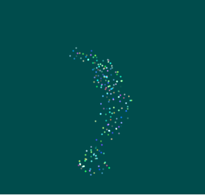

# Glados
This is me learning graphics programming by building my own renderer using OpenGL and ImGui. Most of this code can be found at: https://github.com/TheCherno/Hazel

# Build Instructions

- Start by cloning the repository with git clone `git clone --branch FinalProject --recursive https://github.com/msunde137/Glados`
- Run GenerateGlados.bat to make the project files

# CS312 Final Project

## Project Description

For this project I added support for particle systems into the preexisting Glados library, and experimented with boids! I started by updating the existing renderer with the batch renderer from Hazel to make passing lots of quads to the GPU faster. Unfortunately this involved a lot of debugging of both my and TheCherno's code, but I'm glad I have it now that everything works. Next, I used a lot of code from our previous lab to make a more abstract particle class that is easier to subclass. I added test to my prexisting test framework, and got everything working with the confetti particle system from the previous lab. Now I was able to research and implement a boid particle system. The final piece of this project was optimization. Storing and updating particles in a stack was inefficiet for large numbers of particles, so Aline suggested I implement a kd-tree handle searching for the each particle's neighbors. I ended up using the kd-tree in https://github.com/snape/RVO2-3D, to handle this.

## Implemented Features

### Particle class with ImGui wiggets

I implemented an abstract particle class with Update, Render, and ImGuiRender methods that will be partially overwritten by subclasses. This is mostly based on the particle system lab, with some added functionality for ImGui.

#### Boids 

The example subclasses of my particle system implement a boid simulation. Boids are systems with simple rules and complex behaviours. In this case, I am using the following rules:

1. The particles tend to attract each other
2. The particles repell each other at a certain range
3. The particles try to allign their direction 

When using the boid demos, the ImGui controlls will look like this:

Implemented in the base class:

- Max Particles: How many particles the system can handle. Changing this value won't remove particles from the system.
- Starting Particles: How many particles to initiallize the system with.

Implemented in the boid subclasses:

- Max Speed: How fast the particles can travel.
- Attraction Range: Max distance for neighbor search.
- Attraction: Strength of attraction.
- Repulsion Range: Max distance of repulsion.
- Repulsion: Strength of the repulsion.
- Alignment: How heavily to weight the alignemnt of partiles.
- Bounds: The bounding box of the particle system.

### KdTree

Most of this code is taken from the 'RVO2-3D' repository, but I did have to adapt it for my own purposes. This involved removing much of the functionality of the agent class, and making my particle class a subclass of it. This modification allows me to reuse the kd-tree for other non-particle simulations in the future.

A kd-tree is a spacial datastructure, making it easy to find the nearest neighbors of any stored object. The tree is initiallized with a list of neighbors, and the base node is found at the median of the list. The branches are formed by dividing the space into hyperplanes, with the left and right nodes being on opposite sides of each hyperplane. The 'RVO2-3D' repository implements this datastructure in such a way that it is efficient for nodes that are constantly changing position, making it the perfect tool for speeding up my simulations.

## Results

The boids that I experimented with as a part of the project worked out well. The ammount of time I spent setting everything up, limmited how creative I was able to be with the particle systems themselves, but what I have now behaves exactly as exptected. With the addition of the kd-tree, I am able to simulate 400 boid particles at around 20fps.

The ImGui tools were helpful in understanding how the boids work. For example, changing the attraction difference will form larger groups of particles.

Or, when the Repulsion and Repulsion range are set higher, the particles will spread out more evenly across the bounding area.

